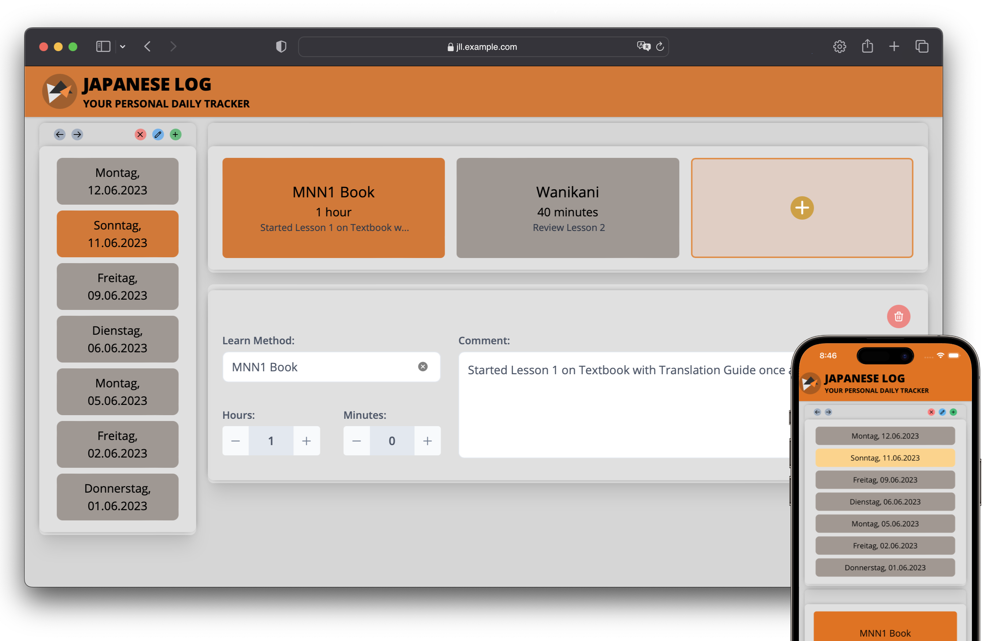

# Japanese Learning Log Py

A tool that helps you to log / track your invested time in learning japanese, or anything really. You can use it as your daily learning diary! 

Required / ~~Programmed with: Python 3.9, Node v12~~
Updated to work with Python 3.11, Node v18.13

 
  
Older versions? 

    If you want use older python/node versions, look into the installAndBuild.sh/bat files and use the commented segments instead

## Setup 

### Docker
You can use docker to automatically deploy this webapp. Just install Docker and git to your server / machine and clone the repository: 
`git clone https://github.com/getraid/JapaneseLearningLogPy.git`.  

After that you can use `docker build -t japaneselog . ` to create a local image. Then you have the option to run it "Simple" or "with folder bindings", so that you can access the DB and config easily.

Simple Container: `docker run -d -it --name JLL -p 5000:5000 japaneselog:latest`  
Now visit the website on your defined port (`http://localhost:5000/` in this case). 

 
  
Folder Bindings?

    or Container with folder bindings: 

    docker run -d -it --name JLL -p 5000:5000 -v ./localConfDir:/app/config -v ./localDBDir:/app/database  japaneselog:latest  

  Here localConfDir and localDBDir are a local folder that you have to create. 
  The sqlite database gets redirected in there and the `config.ini` can beprovided there as well. 

### Manual Installation
Clone the repository to your server with `git clone https://github.com/getraid/JapaneseLearningLogPy.git`
Install all dependencies: `pip3 install -r requirements.txt`

Build depedencies: execute the `installAndBuild.bat`(Windows) or `./installAndBuild.sh`(macOS or Linux in Terminal) to build the frontend
Start: `python3 start.py`

To run this in the background on a Linux server, please look into [services](https://www.google.com/search?q=linux+setup+service).

## Settings
This server application has all its settings "baked in", but you can simply override them.
If you want to that, copy `config.ini.sample` to `config.ini` and edit them.

### Settings explaination
**port** - The port of this server application. Make sure to allow it in your firewall.

**host** - Can be 127.0.0.1 for localhost only, 0.0.0.0 for all network interfaces or an individual ip-adress

**usePassword** - This enables a basic http-authentication with the username/password below. Please don't run this publicly without https. If you want to run this with https, fork and modify the code or simply use [caddy](https://caddyserver.com/) with a reverse proxy. This was/is primary meant for "indoor"-use

**user** - the user account name (only one)

**unlock_password** - the user password (only one)

## Usage
Now open your webbrowser at your defined host:port in the settings (default:  `http://localhost:5000/`).

### Navigation
#### Left Side (Date Section):
* ➕ Add current date
* 🖊️ Add other dates
* ❌ Remove dates
* ⬅️➡️Change date range
* 👆 Select date

#### Right Side (Entry Section): 
##### Upper Space:
* ➕ Add section for selected date
* 👆 Select entry

##### Lower Space:
* 📄 Learn Method: create or select a learn method
* ⌚ Hour, Minutes: Set your invested time
* 💬 Comment: Anything you want to add!

## Development
To work on the gui check out JapaneseLearningLogFrontend. 
Before that, you should disable the `usePassword` option in the `config.ini` file. 

In order to debug, you just start this python server and run it in the background. Then move into the JapaneseLearningLogFrontend folder and run `npm install && npm run serve` there.
The actual UI testing will be easier this way. Once you're done, simply run `npm run build` in the JapaneseLearningLogFrontend directory and it will output its contents into the static folder here. 
Now you can just navigate to your defined host:port address of the regular server.